# NerdQuiz

> Gamified IT exam prep platform for [ITPEC FE](https://itpec.org/pastexamqa/fe.html) certification — learn topics, practice
> quizzes, track XP and streaks, review mistakes, and simulate real exams.

[](https://github.com/vibe-code-tours/team-16-app/actions/workflows/ci.yml)
[](https://github.com/vibe-code-tours/team-16-app/actions/workflows/security.yml)
[](https://nerdquiz-16.netlify.app)
[](LICENSE)

---

## Table of Contents

- [Features](#features)
- [Screenshots](#screenshots)
- [Tech Stack](#tech-stack)
- [Architecture](#architecture)
- [Quickstart](#quickstart)
- [Project Structure](#project-structure)
- [Deployment](#deployment)
- [Contributing](#contributing)
- [Team](#team)
- [License](#license)

---

## Features

### Core Learning Loop

| Feature | Description |
|---------|-------------|
| **Learning Map** | Visual topic tree — 5 milestone categories (Technology, Security, Management, Strategy, Business) × 20 topics with locked/unlocked progression |
| **Short Lessons** | Markdown-rendered reading notes (2–3 min) with key points, tips, and examples — 32+ seeded lessons |
| **5-Question Quizzes** | Bite-sized practice after each lesson with instant feedback, explanations, and XP rewards |
| **XP & Streaks** | Earn 10 XP per correct answer, maintain daily login streaks 🔥 |
| **Mistake Garden** | Automatically collects wrong answers for review — question, your answer, correct answer, and explanation all in one place |
| **Exam Simulation** | 60-question timed session with countdown timer, 3-heart lives system, and difficulty selector — mirrors real ITPEC FE conditions |
| **Weak Point Analysis** | Topic-level accuracy tracking with color-coded mastery indicators (red/yellow/green) and direct links to targeted practice |
| **User Profile** | Total XP, streak, level badge, learning statistics, weekly activity chart, and achievements |

### Platform Features

| Feature | Description |
|---------|-------------|
| **Admin Dashboard** | Platform health monitoring — stat cards (total users, active today, quiz attempts, pass rate), charts (DAU, topic engagement, completion pie) |
| **Admin User Management** | Searchable/sortable user table, quick filters (Active Today, Inactive 30d+), detail drawer (Overview/Activity/Performance), actions (change role, deactivate, CSV export) |
| **Dark/Light Theme** | Semantic CSS variables with Tailwind `dark:` classes, toggle on Profile page |
| **Mobile-Responsive** | Tailwind mobile-first design, hamburger navigation, keyboard-accessible sidebar |
| **AI Content Engine** | 3-agent pipeline (Extractor → Reviewer → Weaver) that extracts questions from ITPEC PDFs and generates lesson content |
| **Rule-Based Difficulty** | Auto-assigns easy/medium/hard from question metadata |
| **Google OAuth** | One-click sign-in via Supabase Auth |

---

## Screenshots

| Landing Page | Learning Map | Quiz |
|:---:|:---:|:---:|
| 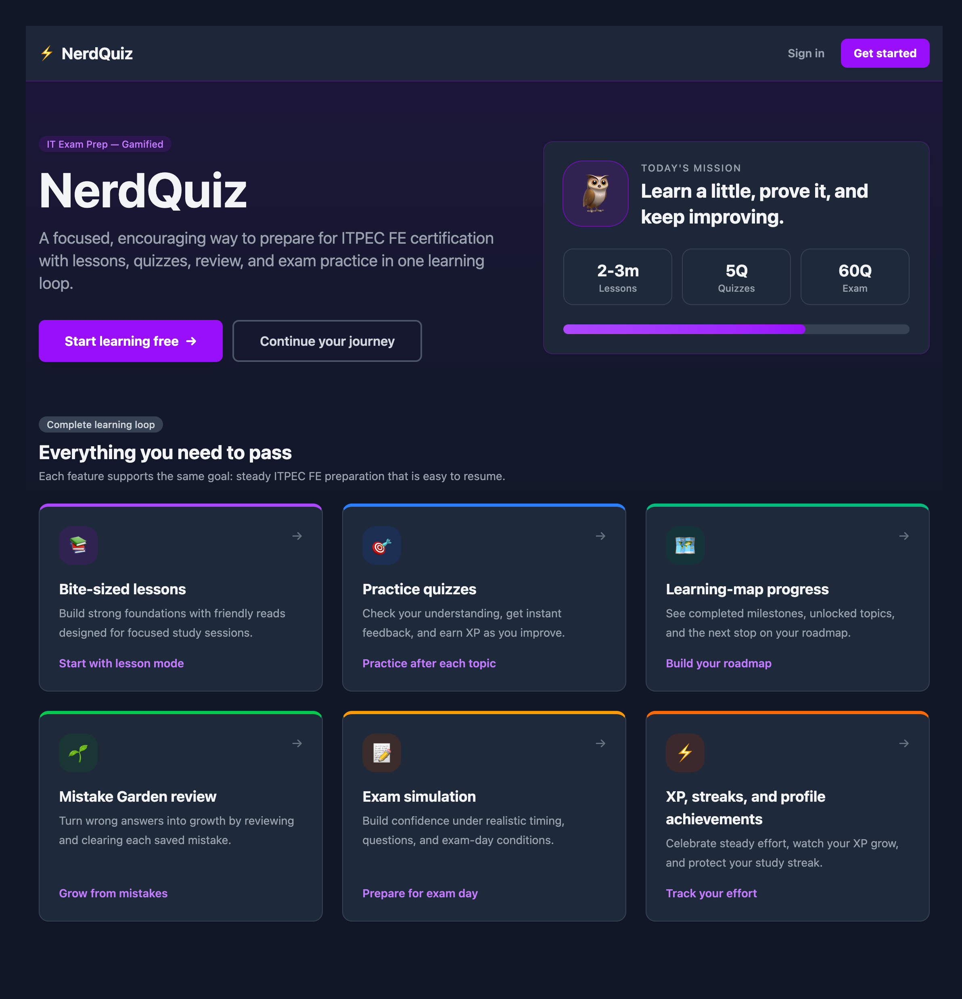 | 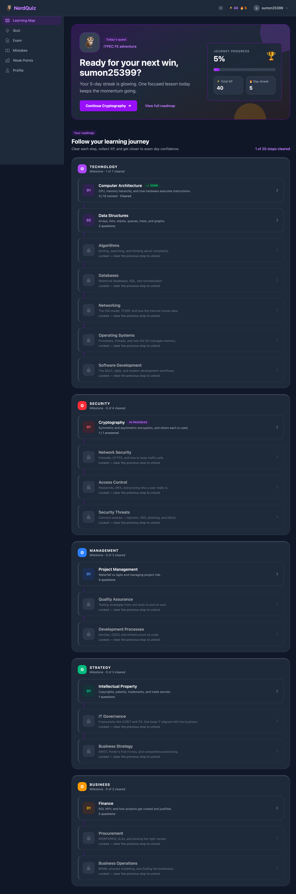 | 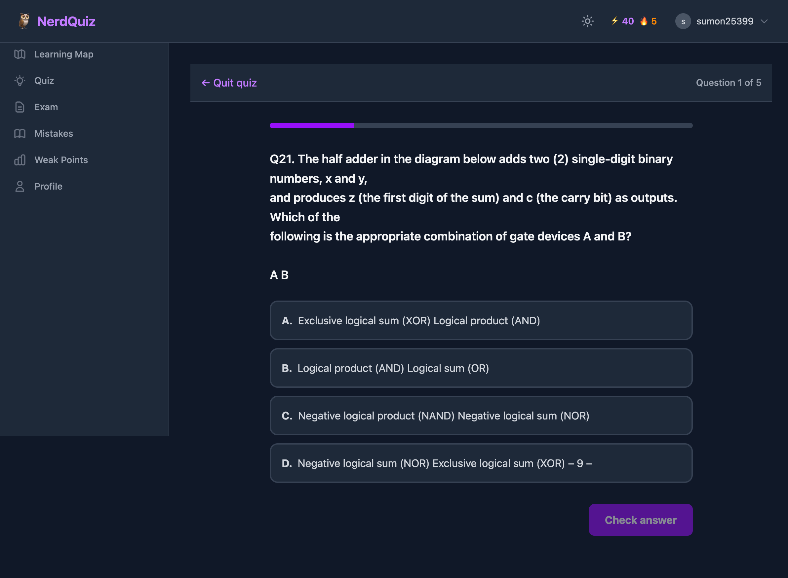 |

| Mistake Garden | Exam Simulation | Weak Point Analysis |
|:---:|:---:|:---:|
| 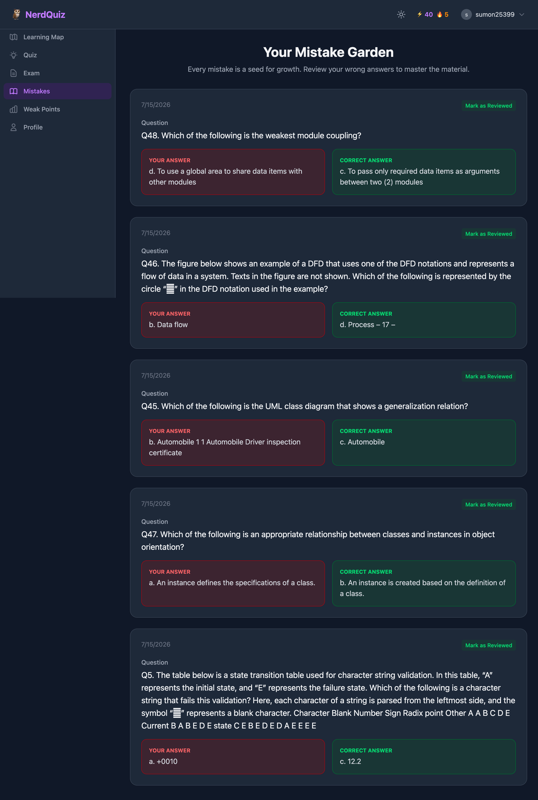 | 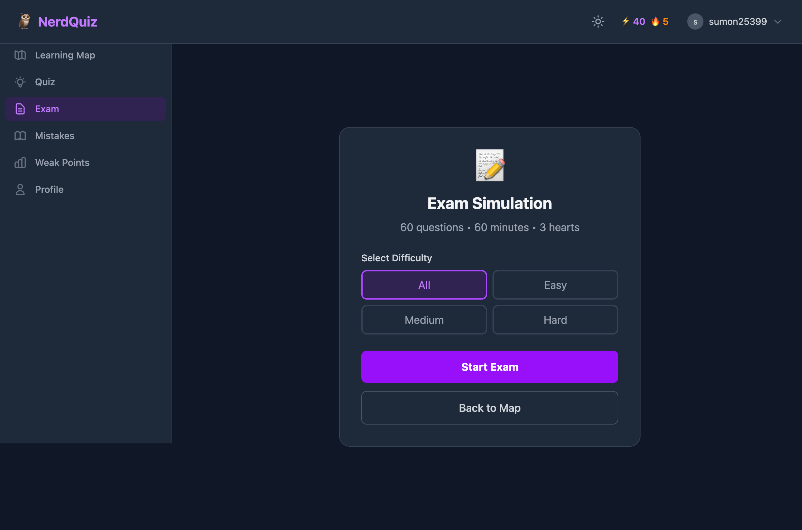 | 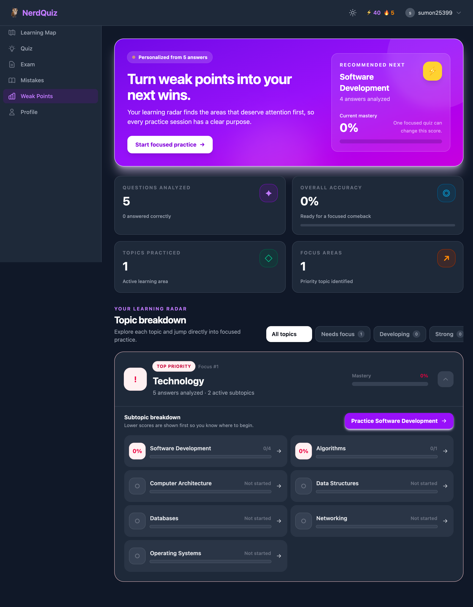 |

| Profile & Streaks | Admin Dashboard | Admin User Management |
|:---:|:---:|:---:|
| 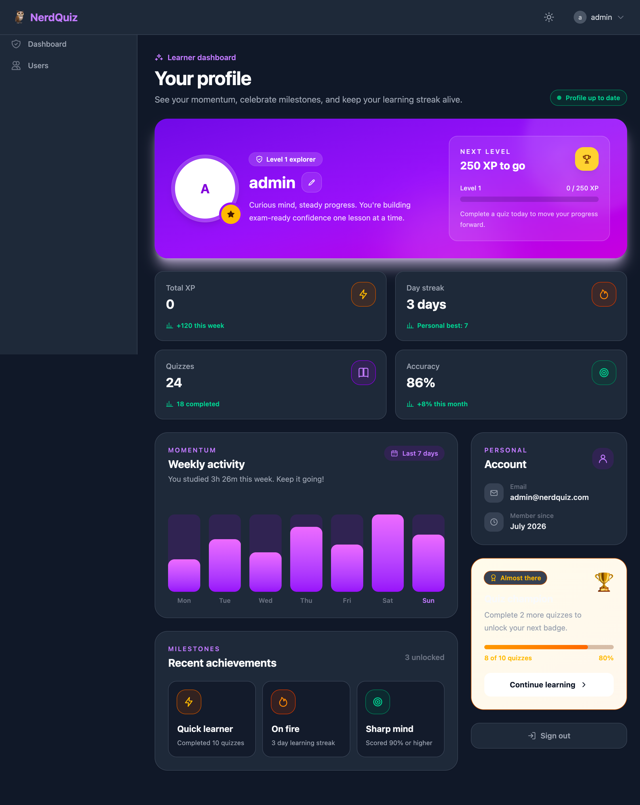 | 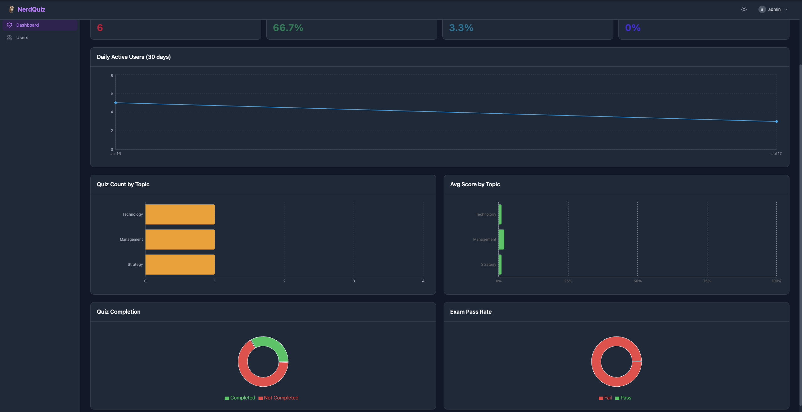 | 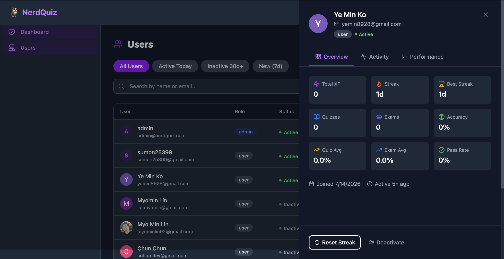 |

| Lesson Content | AI Content Engine | Topic Detail |
|:---:|:---:|:---:|
| 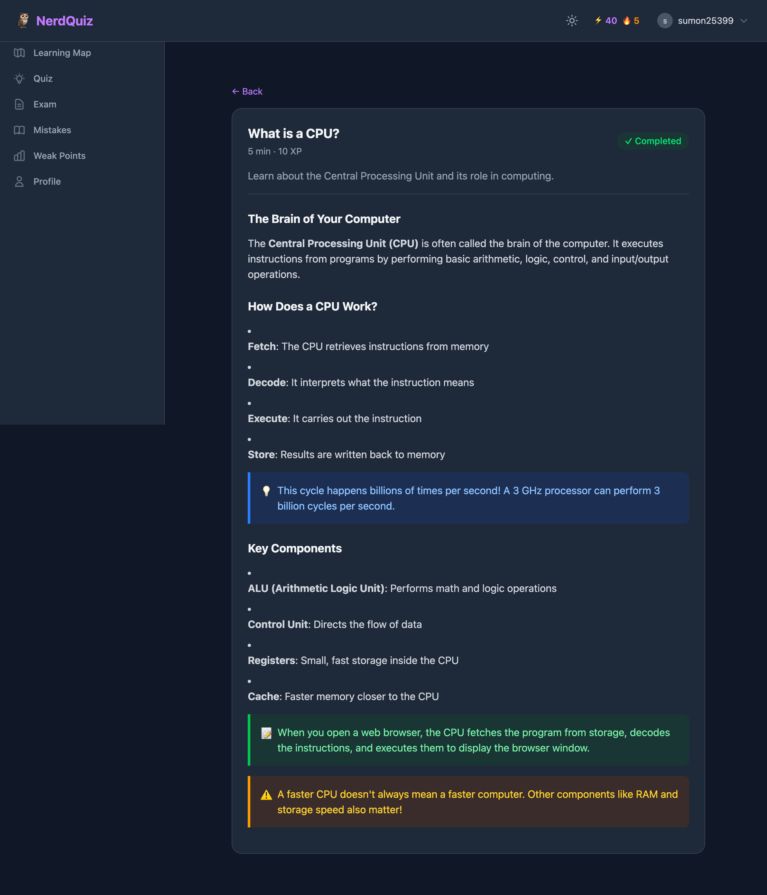 | 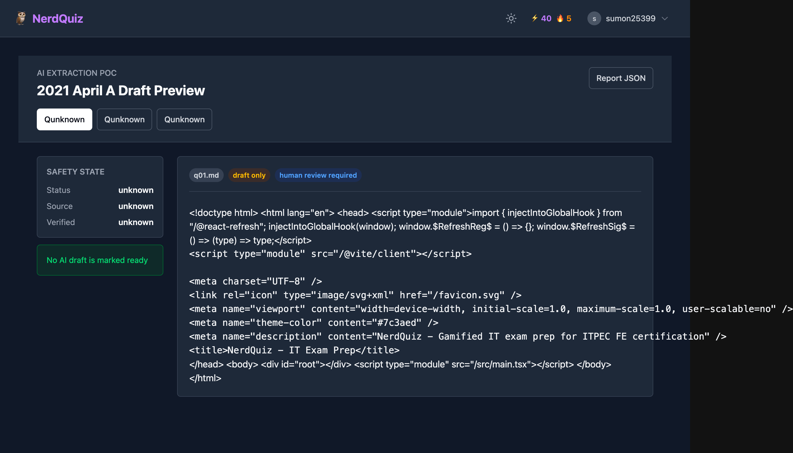 | 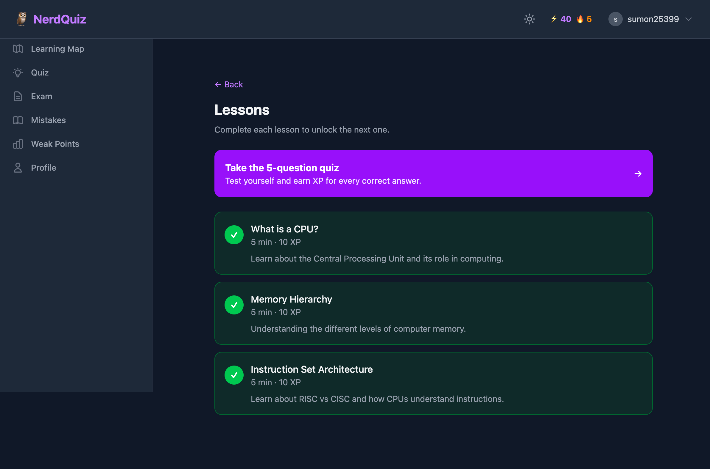 |

> More screenshots: [Login](docs/slides/screenshots/02-login.png) · [Register](docs/slides/screenshots/03-register.png) · [Quiz Listing](docs/slides/screenshots/05-quiz-listing.png)

**Live demo:** [https://nerdquiz-16.netlify.app](https://nerdquiz-16.netlify.app)

---

## Tech Stack

| Layer | Technology |
| :--- | :--- |
| **Frontend** | [React 19](https://react.dev/) · [TypeScript](https://www.typescriptlang.org/) · [Tailwind CSS 4](https://tailwindcss.com/) · [React Router v7](https://reactrouter.com/) · [Vite](https://vitejs.dev/) |
| **Backend** | [Java 25](https://openjdk.org/projects/jdk/25/) · [Spring Boot 3.5](https://spring.io/projects/spring-boot) · Spring Data JPA · Spring Security · [Nimbus JOSE+JWT](https://connect2id.com/products/nimbus-jose-jwt) |
| **Database** | [Supabase](https://supabase.com/) (PostgreSQL) with Row-Level Security |
| **Auth** | [Supabase Auth](https://supabase.com/docs/guides/auth) — email/password + Google OAuth, JWT verified by backend |
| **Hosting** | [Netlify](https://www.netlify.com/) (frontend) · [Cloud Run](https://cloud.google.com/run) (backend) |

### Key Frontend Dependencies

| Package | Purpose |
|---------|---------|
| `@supabase/supabase-js` | Supabase client SDK for auth + direct database access |
| `lucide-react` | Icon library |
| `react-markdown` | Markdown rendering for lesson content |
| `class-variance-authority` | Component variant management |
| `clsx` + `tailwind-merge` | Conditional class merging |

### Key Backend Dependencies

| Package | Purpose |
|---------|---------|
| `spring-boot-starter-data-jpa` | Database ORM |
| `spring-boot-starter-security` | JWT authentication, filter chain |
| `spring-boot-starter-validation` | Jakarta Validation (`@Valid`) |
| `nimbus-jose-jwt` | JWT verification against Supabase JWKS |
| `postgresql` | PostgreSQL JDBC driver |

---

## Architecture

```
┌──────────────┐       ┌──────────────────┐       ┌──────────────────┐
│   React SPA  │──────▶│  Spring Boot API  │──────▶│  Supabase        │
│  (src/web/)  │       │  (src/api/)       │       │  (Postgres DB)   │
│              │       │                   │       │                  │
│  React Router│       │  REST endpoints   │       │  Migrations in   │
│  Tailwind CSS│       │  JWT verification │       │  supabase/       │
└──────┬───────┘       └───────────────────┘       └──────────────────┘
       │
       │  Supabase Auth SDK
       │  (register, login, session)
       ▼
┌──────────────────┐
│  Supabase Auth   │
│  (managed)       │
└──────────────────┘
```

**Key design decisions:**

- **Two-path data access:** The frontend calls Supabase Auth **directly** for registration and login — credentials never pass through the backend. Spring Boot receives a JWT on every API call and verifies it against Supabase's JWKS endpoint.
- **Stateless backend:** No HTTP sessions — every request is authenticated via JWT bearer token.
- **Defense in depth:** Row-Level Security (RLS) at the database level + JWT verification at the API level.
- **AI-powered content pipeline:** Three agents (Extractor → Reviewer → Weaver) transform ITPEC PDFs into structured quiz data and lesson content.

> Full architecture details: [docs/ARCHITECTURE.md](docs/ARCHITECTURE.md)  
> Entity-Relationship diagram: [docs/diagrams/ER_diagram.png](docs/diagrams/ER_diagram.png)  
> Architecture Decision Records: [docs/decisions/](docs/decisions/)

---

## Quickstart

### Prerequisites

- **Java 25** (JDK) — [Download](https://adoptium.net/) or `brew install openjdk@25`
- **Node.js 20+** and npm — [Download](https://nodejs.org/) or use `nvm`
- **Docker Desktop** — [Download](https://www.docker.com/products/docker-desktop/)
- **Supabase CLI** — `npm install -g supabase`

### 1. Clone and configure

```bash
git clone <your-repo-url> && cd team-16-app
cp .env.example src/api/.env   # fill in real values locally — never commit .env
```

### 2. Start the local database

```bash
supabase start              # spins up Postgres + auth via Docker
supabase db reset           # apply migrations and seed data
```

### 3. Run the backend

```bash
cd src/api
./gradlew bootRun           # starts Spring Boot on http://localhost:8080
```

### 4. Run the frontend

```bash
cd src/web
npm install
npm run dev                 # starts Vite dev server on http://localhost:5100
```

Open **http://localhost:5100** in your browser.

> For detailed setup instructions, see [SETUP.md](SETUP.md).

---

## Project Structure

```
team-16-app/
├── src/
│   ├── api/                        # Spring Boot REST API (Java 25)
│   │   └── src/main/java/com/nerdquiz/
│   │       ├── config/             # Security, CORS, JWT filter
│   │       ├── controller/         # REST controllers (thin — delegate to service)
│   │       ├── service/            # Business logic
│   │       ├── repository/         # Spring Data JPA repositories
│   │       ├── model/              # JPA entities
│   │       ├── dto/                # Request/Response DTOs (records)
│   │       └── exception/          # Global exception handler
│   └── web/                        # React SPA (Vite + TypeScript)
│       └── src/
│           ├── components/
│           │   ├── ui/             # Shared primitives (Button, Card, Badge)
│           │   └── features/       # Feature-specific components
│           ├── hooks/              # Custom hooks (useAuth, useQuizSession, etc.)
│           ├── routes/             # Page components (one per route)
│           ├── lib/                # Supabase client, API client utilities
│           ├── types/              # TypeScript interfaces/types
│           └── styles/             # Tailwind directives (globals.css)
├── supabase/
│   ├── migrations/                 # Database schema (version-controlled SQL)
│   └── seed_data/                  # Seed data (exam questions, lessons)
├── docs/
│   ├── ARCHITECTURE.md             # System diagram and layout
│   ├── REQUIREMENTS.md             # MVP scope
│   ├── DESIGN-GUIDELINES.md        # Visual design principles
│   ├── decisions/                  # Architecture Decision Records (ADRs)
│   ├── slides/                     # Demo presentation + screenshots
│   └── gsd/                        # How-we-work, feature board, boundaries
├── .github/
│   └── workflows/                  # CI + security scanning
├── .claude/
│   ├── rules/                      # Coding conventions (backend, frontend, etc.)
│   └── skills/                     # AI-assisted development skills
├── docker-compose.yml              # Backend Docker setup
├── netlify.toml                    # Frontend deployment config
├── .env.example                    # Secret hygiene — copy to .env, never commit
└── README.md                       # You are here
```

---

## Deployment

### Frontend — Netlify

The frontend automatically deploys from the `main` branch via GitHub Actions. Configure these environment variables in the Netlify dashboard:

| Variable | Description |
|----------|-------------|
| `VITE_SUPABASE_URL` | Supabase project URL |
| `VITE_SUPABASE_ANON_KEY` | Supabase public anonymous key |
| `VITE_API_URL` | Backend API base URL |

### Backend — Cloud Run

The backend is containerized via Docker and deployed to Google Cloud Run. Configure these GitHub secrets:

| Secret | Description |
|---------|-------------|
| `DATABASE_URL` | Postgres connection string (Supabase session pooler) |
| `SUPABASE_URL` | Supabase project URL |
| `SUPABASE_ANON_KEY` | Supabase public anonymous key |
| `CORS_ALLOWED_ORIGINS` | Frontend origin(s) |
| Secrets for Google Cloud authentication | Service account credentials |

### Database Migrations

```bash
supabase login
supabase link --project-ref <project-ref>
supabase db push
```

> Full deployment instructions: [docs/ARCHITECTURE.md](docs/ARCHITECTURE.md)

---

## Contributing

We use a **GSD (Get Stuff Done)** approach — each developer owns their feature end-to-end.

### Git Workflow

1. Branch from `main`: `git checkout -b feature/my-feature`
2. Stage changes: `git add <files>`
3. Run AI-powered review: `/pr-review`
4. Fix any findings, then commit
5. Push and open a PR: `gh pr create`
6. Squash merge to `main`

**When teammate review is needed:** schema changes, new API endpoints, auth flow changes, new shared dependencies.

> See [.claude/rules/git-workflow.md](.claude/rules/git-workflow.md) for full workflow details.

### Development Guidelines

- **Frontend:** React + TypeScript + Tailwind CSS. One component per file, PascalCase. Business logic in custom hooks.
- **Backend:** Java 25 + Spring Boot. Thin controllers, service-layer business logic, Java records for DTOs.
- **Testing:** JUnit 5 + Mockito (backend), Vitest + React Testing Library (frontend).
- **Security:** Never commit secrets. Never log PII. JWT authentication on every request.

---

## Team

Built by 8 developers in 2 weeks (July 2026).

| Role | Person |
|------|--------|
| **Backend Lead / Deployment** | Myo Min Lin |
| **Frontend Lead** | Team collaboration |
| **Quiz / Lesson Flow** | Ye Min Ko |
| **Learning Map** | Htet Lin Ko |
| **Authentication** | Sandar Win |
| **Data Extraction** | Myat |

---

## License

[MIT](LICENSE) — feel free to use, modify, and share.

---

<p align="center">
  <strong>NerdQuiz</strong> — <em>IT Exam Prep, Gamified</em><br>
  Built with ❤️ and ☕ by 8 developers<br>
  <a href="https://github.com/vibe-code-tours/team-16-app">GitHub</a>
</p>
